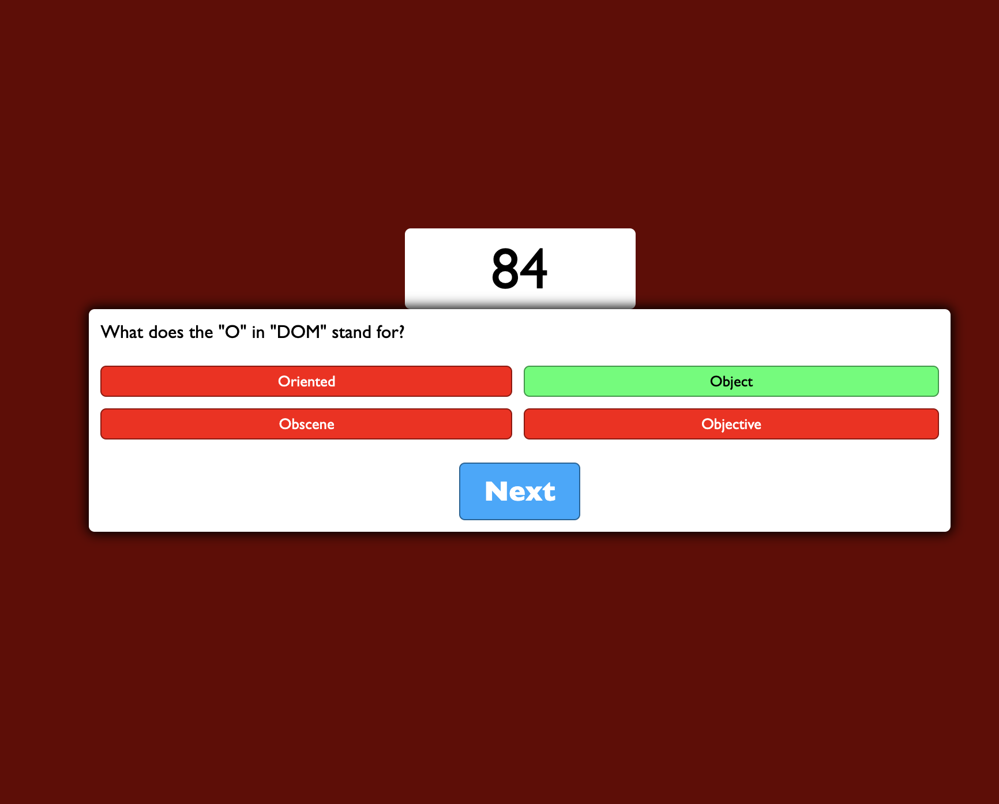

# coding-quiz

## asks user a total of ten questions with four multiple choice answers each. Timer counts down starting when user clicks the 'start' button. Timer decrements by an additional ten seconds for each wrong answer. Once the user has answered ten questions, or once the timer has reached zero, the game is over. User is asked to enter their initials and the program saves the initials along with remaining seconds as the score. 

## Credits: made by Thomas Upchurch with inspiration and help from youtuber Florin Pop at video https://youtu.be/x7WJEmxNlEs

